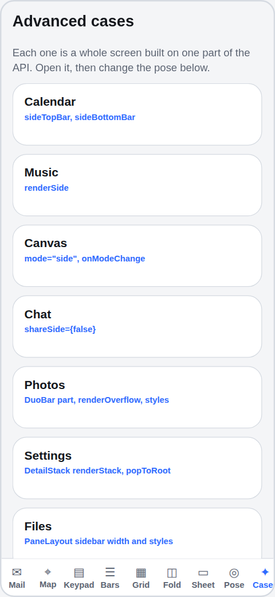
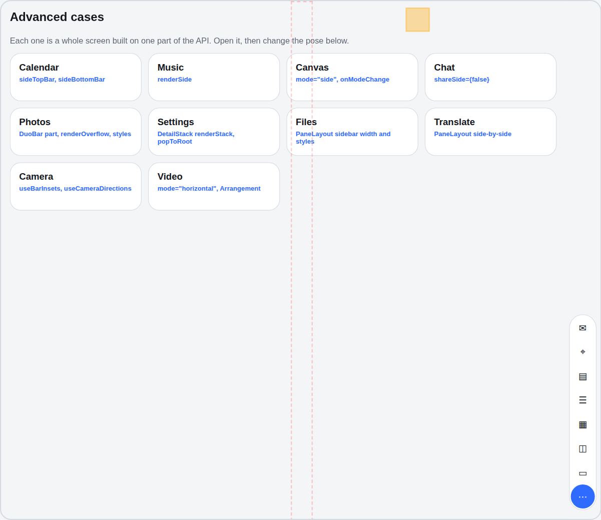

# react-native-duo example

Every API in `@garrettmacmac/react-native-duo` in one Expo app. Metro resolves the package to `../src`, so edits there
reload here.

```sh
npm install
npx expo start          # Expo Go or the web
npx expo run:ios        # a development build with the native module (Xcode 27.1, iPhone Duo simulator)
npx expo run:android    # a foldable emulator reports its fold
```

The bar along the bottom picks a pose. **Live** is this device; every other pose previews the app as it would draw on
a closed or open iPhone Duo, partly folded, in a split view, with a pinned video, on a phone or on an iPad. The fold is
drawn in red and the cameras in amber, dashed while inactive.

| Demo | Shows |
| --- | --- |
| Mail | `DuoPage` per pane, `PaneLayout arrangement="list-detail"`, `DetailStack` (open the attachment to go deeper), bar `group`s |
| Map | `PaneLayout arrangement="sheet"`: a sheet over a map, split only by an active fold |
| Keypad | `usePane()`: four columns in a tall pane, five on the closed iPhone Duo |
| Bars | `verticalBarLayout` compression: the toolbar folds into More, or the tab bar shrinks |
| Grid | `useEvenColumns`: 1, 2 or 4 columns |
| Fold | `AvoidReservedRegions`: a button stepping out of the fold |
| Sheet | `useSheetPose`: placement, vertical controls, the fold and the camera |
| Pose | `useDuo`, `usePane`, `useFold`, `useSplitWindow`, `useCameraDirections` |
| Cases | Ten whole screens, one per advanced use: `sideTopBar`, `renderSide`, `mode`, `shareSide`, `DuoBar` `part`, `DetailStack` `renderStack`, sidebar widths, `side-by-side`, self-drawn camera controls, `Arrangement` |

The tab bar is the outer `DuoPage`'s `bottomBar`: a row at the bottom on a phone, a capsule at the bottom of the side
strip on the iPhone Duo, with a More menu for what does not fit. Each demo's own bars join the same strip.

On the web, `?demo=mail&pose=closed&message=2` opens a demo in a pose and `?case=settings&pose=partlyFoldedTabletop&section=general&path=About/Legal`
opens an advanced case, which is how the README's pictures are taken. The cases live in [`src/cases/`](src/cases), one
file each.

 
